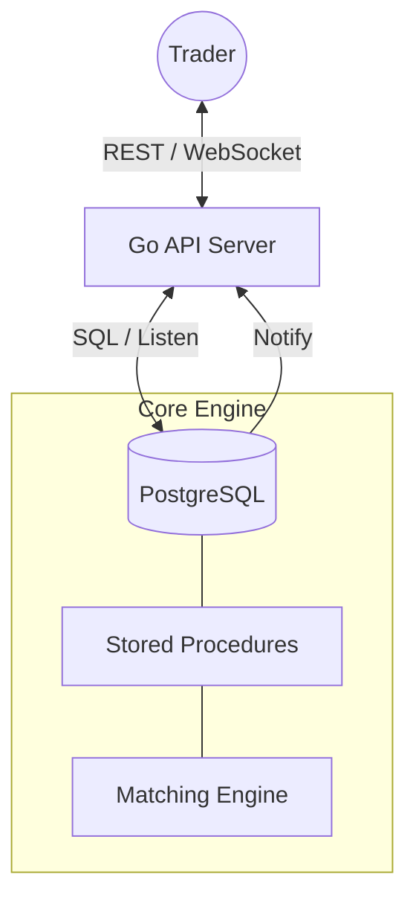

# ☀️ Helios: Real-Time Digital Asset Trading Platform


**Helios** is a high-performance digital asset trading simulation platform designed for ultra-low latency order matching and real-time market data synchronization. Built with a robust Go backend and a core matching engine powered by PostgreSQL stored procedures, Helios provides a production-grade environment for simulating complex trading strategies.

---

## 🚀 Key Features

- **⚡ High-Performance Matching Engine**: Atomic order matching handling LIMIT and MARKET orders with sub-millisecond database execution.
- **📡 Real-Time WebSocket Synchronization**: Live order book and trade updates via PostgreSQL `LISTEN/NOTIFY` and Go-driven WebSockets.
- **🛡️ Secure Balance Management**: "Hold/Release" accounting model prevents double-spending and ensures total equity integrity.
- **📊 Rich Trading Interface**: Responsive vanilla JS frontend with live depth charts, order history, and account analytics.
- **👮 JWT Authentication**: Secure session management for protected API endpoints.
- **💸 Extensible Fee System**: Configurable maker/taker fee structures integrated into the core matching loop.

---

## 🏗️ System Architecture

Helios employs a three-tier architecture optimized for data integrity and real-time delivery.



---

## 🛠️ Tech Stack

- **Backend**: [Go](https://go.dev/) (Gin Gonic)
- **Database**: [PostgreSQL](https://www.postgresql.org/) (pgxpool)
- **Frontend**: HTML5, CSS3 (Vanilla), JavaScript (ES6)
- **Real-time**: WebSockets + PostgreSQL `NOTIFY`
- **Security**: JWT (Bcrypt for password hashing)

---

## 🏁 Getting Started

### Prerequisites

- Go 1.21+
- PostgreSQL 14+

### 1. Database Setup

```bash
# Create database
psql -U postgres -c "CREATE DATABASE helios;"

# Load schema and business logic
psql -U postgres -d helios -f db/schema.sql
psql -U postgres -d helios -f db/procedures/user_auth_procs.sql
psql -U postgres -d helios -f db/procedures/order_query_procs.sql
psql -U postgres -d helios -f db/procedures/matching_engine_procs.sql

# (Optional) Seed initial data
psql -U postgres -d helios -f db/seed_data.sql
```

### 2. API Configuration

```bash
cd api
cp .env.example .env
# Edit .env with your database credentials
```

### 3. Run the Platform

```bash
# Start the Backend
cd api
go run main.go

# Start the Frontend
# Open UI/index.html in your browser or host it with a static server (e.g., Live Server)
```

---

## 📁 Project Structure

- `api/`: Go source code, middleware, and API handlers.
- `db/`: SQL schema definitions and stored procedures (Matching Engine).
- `UI/`: Frontend assets (HTML, CSS, JS).
- `docs/`: Testing guides and benchmark reports.

---

## 👥 Contributors

- **Bhavesh Pant** - Matching Engine & Repository Owner
- **Muneef Khan** - User & Account Management
- **Sandhya** - Order Management

---

## 📄 License

This project is licensed under the MIT License - see the LICENSE file for details.

---

**Happy Trading! 🚀💰**
